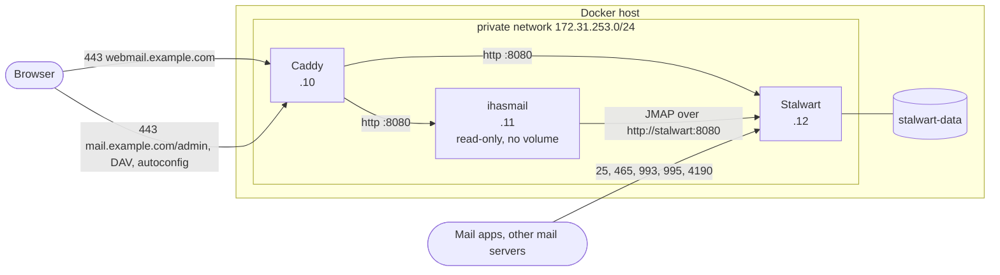
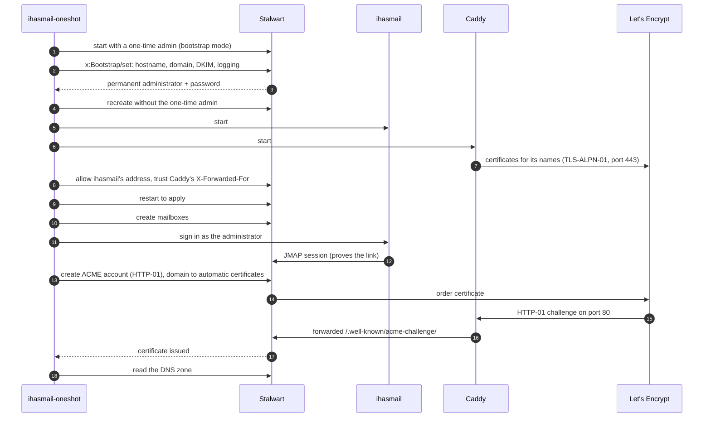

# ihasmail-oneshot

[](https://github.com/Coffey-Labs/ihasmail-oneshot/releases/latest)
[](LICENSE)

**One command that turns a Linux Docker host into a working mail server with
webmail.** It deploys a fresh [Stalwart](https://stalw.art) mail server and a
fresh [ihasmail](https://github.com/Coffey-Labs/ihasmail) webmail, links them
together, gets them certificates, and hands you the administrator password and
the DNS records to publish.

```bash
ihasmail-oneshot deploy --domain example.com --user alice
```

When it finishes you have a mail server for `example.com`, webmail at
`https://webmail.example.com`, Stalwart's admin UI at
`https://mail.example.com/admin`, and a mailbox for `alice@example.com`. Once
you publish the DNS records it hands you, mail flows in and out. What it
leaves behind is an ordinary `docker compose` project, managed with the usual
commands and not tied to this tool.

---

- [What it is](#what-it-is)
- [What it does](#what-it-does)
- [Why it exists](#why-it-exists)
- [Requirements](#requirements)
- [Installing](#installing)
- [Trying it locally in two minutes](#trying-it-locally-in-two-minutes)
- [Deploying a mail host, step by step](#deploying-a-mail-host-step-by-step)
- [The deployment directory](#the-deployment-directory)
- [Running it afterwards](#running-it-afterwards)
- [Command reference](#command-reference)
- [How it works](#how-it-works)
- [Security model](#security-model)
- [Troubleshooting](#troubleshooting)
- [Known limits](#known-limits)
- [Development and testing](#development-and-testing)
- [Versions and releases](#versions-and-releases)
- [License](#license)

---

## What it is

A single, statically linked binary for Linux (amd64 and arm64). You run it on
the Docker host that should become the mail server. It needs Docker and the
compose plugin, and nothing else: no configuration file to write first, no
language runtime, no other scripts.

It deploys three containers:

| Container | Image | Role |
| --- | --- | --- |
| **Stalwart** | `stalwartlabs/stalwart` | The mail server: SMTP, IMAP, POP3, JMAP, CalDAV, CardDAV, spam filtering, DKIM. It holds all the mail and all the accounts |
| **ihasmail** | `ghcr.io/coffey-labs/ihasmail` | The webmail: mail, calendars, contacts, files and filters in the browser, talking to Stalwart over JMAP. It holds nothing but sessions |
| **Caddy** | `caddy` | The HTTPS front: certificates and TLS for the webmail and for Stalwart's web side |

It has two shapes:

| | `deploy --domain example.com` | `deploy --local` |
| --- | --- | --- |
| **For** | A real mail host on the internet | Trying ihasmail against a real Stalwart on your own machine |
| **Containers** | Stalwart, ihasmail, Caddy | Stalwart, ihasmail |
| **Publishes** | 25, 80, 443, 465, 993, 995, 4190 on every interface | Nothing but two loopback ports |
| **Certificates** | Let's Encrypt, for both Caddy and Stalwart | None |
| **Webmail** | `https://webmail.example.com` | `http://127.0.0.1:8080` |
| **Stalwart admin** | `https://mail.example.com/admin` | `http://127.0.0.1:8081/admin` |

## What it does

In order, in one run:

1. **Checks the host** before changing anything: Docker and compose are there
   and usable, every port it needs is free, the deployment directory is new or
   empty, no compose project of the same name exists, and the hostnames resolve.
   It reports every problem at once, not the first.
2. **Shows you the plan and asks** before going ahead. `--yes` skips the
   question, and is required when there is no terminal to ask on.
3. **Writes the deployment directory**: `compose.yaml`, the `Caddyfile`, and
   `.env` holding a freshly generated `APP_SECRET`.
4. **Pulls the images**, pinned to versions tested together.
5. **Starts Stalwart in bootstrap mode** with a one-time administrator whose
   password exists only in the tool's memory.
6. **Completes Stalwart's setup** through its API, the same setup its web UI
   would otherwise walk you through: hostname, mail domain, DKIM keys, logging.
   Stalwart creates the permanent administrator and returns its password, which
   is written to `credentials.txt` straight away.
7. **Starts the whole stack.** Stalwart is recreated *without* the one-time
   administrator.
8. **Links ihasmail and Stalwart**: exempts ihasmail from Stalwart's automatic
   IP bans, tells Stalwart to trust the client addresses Caddy forwards, and
   restarts Stalwart so both apply.
9. **Creates the mailboxes** you asked for with `--user`, each with a generated
   password.
10. **Proves the link** by signing in *through ihasmail* as the administrator.
    That only succeeds if ihasmail can reach Stalwart and Stalwart accepts the
    credentials.
11. **Requests certificates** (mail host only): sets up an ACME account in
    Stalwart for its IMAP and SMTP certificate, and waits for that and for
    Caddy's certificates to arrive.
12. **Writes `dns-records.zone`**, every DNS record Stalwart wants published,
    and prints a summary of URLs, credentials and anything still to do.

## Why it exists

Stalwart and ihasmail each install easily on their own. Making them a working,
safe mail host *together* takes a series of decisions that are easy to get
wrong, and most of the mistakes don't show until later:

- **Stalwart 0.16 has no configuration file to template.** Its settings live in
  its data store, and a new server starts in a bootstrap mode that expects a
  person at a web wizard. Automating that means driving its registry API, and
  making sure the bootstrap credential doesn't quietly outlive the setup.
- **Both services want the same ports for certificates.** The webmail needs
  HTTPS on 443. Stalwart needs its own certificate for IMAP and SMTP, and its
  default way of getting one also wants port 443. Two ACME clients fighting over
  one port fail in confusing, intermittent ways.
- **Stalwart's automatic IP bans don't expect a proxy in front of it.** Stalwart
  bans addresses that probe for things like WordPress admin pages. Behind a
  reverse proxy, every client arrives from the proxy's address, so one bot
  scanning your mail host gets *the proxy* banned. Autoconfig, calendar sync and
  certificate renewals all stop working, for everyone, with nothing obviously
  wrong. This was reproduced on Stalwart 0.16.22 while building this tool, as
  was a second trap: the setting that fixes it only takes effect after a
  restart.
- **The route from webmail to mail server matters.** Sent over the private
  Docker network, it never leaves the host and costs about a third of the
  memory per signed-in browser tab that going back out over public HTTPS does.
- **Mail doesn't flow until DNS is right**, and the list of records (MX, SPF,
  DKIM, DMARC, SRV, MTA-STS, autoconfig) is long.

This tool makes each of those decisions once, the same way every time, and
checks the result before telling you it is done. Each one is explained in
[How it works](#how-it-works).

## Requirements

**On the host:**

- Linux, amd64 or arm64.
- Docker Engine with the compose plugin (`docker compose version` works), run
  as a user allowed to use Docker.

**For a mail host, additionally:**

- A domain whose DNS you control.
- **Ports 25, 80, 443, 465, 993, 995 and 4190** free on the host and open in any
  firewall or cloud security group in front of it.
- **Outbound port 25.** Many cloud and VPS providers block it by default and
  unblock it on request. Without it you can receive mail but not send it.
- **Reverse DNS**: a PTR record for the host's IP address naming the mail host
  (`mail.example.com`). This is set at your hosting provider, not in your DNS
  zone. Many receiving servers reject mail from an address without one.
- A static public IP address.

**Resources:** ihasmail on its own needs 256 MiB of RAM at minimum. Stalwart's
needs grow with the mail it stores and the number of people using it; size the
host for Stalwart.

## Installing

### From a release (recommended)

Download the archive for your architecture and its checksums, verify, and
unpack:

```bash
ARCH=amd64   # or arm64
curl -fsSLO https://github.com/Coffey-Labs/ihasmail-oneshot/releases/latest/download/ihasmail-oneshot-linux-$ARCH.tar.gz
curl -fsSLO https://github.com/Coffey-Labs/ihasmail-oneshot/releases/latest/download/SHA256SUMS
sha256sum --ignore-missing -c SHA256SUMS
tar -xzf ihasmail-oneshot-linux-$ARCH.tar.gz
sudo install -m 0755 ihasmail-oneshot /usr/local/bin/
ihasmail-oneshot version
```

Every release is built by the [release workflow](.github/workflows/release.yml)
from a tagged commit on `main`, after the tests and a known-vulnerabilities
check pass. The archives are reproducible: `scripts/build-release.sh` builds the
same bytes from the same commit.

### From source

With Go 1.26.8 or newer:

```bash
git clone https://github.com/Coffey-Labs/ihasmail-oneshot.git
cd ihasmail-oneshot
go build -o ihasmail-oneshot ./cmd/ihasmail-oneshot
```

## Trying it locally in two minutes

To see ihasmail against a real Stalwart on your own machine, without a domain
or open ports:

```bash
ihasmail-oneshot deploy --local --user alice
```

```text
==> a local pair for example.test, in /home/you/ihasmail-example-test
    ihasmail  http://127.0.0.1:8080
    Stalwart  http://127.0.0.1:8081  (admin UI; no mail ports published)
    images    stalwartlabs/stalwart:v0.16.22, ghcr.io/coffey-labs/ihasmail:2026.9.10-pr328
    mailboxes alice
==> preflight
    docker 29.8.0, compose 5.5.1
deploy this? [y/N] y
==> writing /home/you/ihasmail-example-test
==> pulling images
==> starting Stalwart in bootstrap mode
==> setting up Stalwart for example.test (hostname mail.example.test)
    administrator admin@example.test, password in credentials.txt
==> starting the stack
==> linking ihasmail and Stalwart
    ihasmail (172.31.253.11) exempt from Stalwart's auto-ban
    restarting Stalwart to apply them
    mailbox alice@example.test created
    signed in to ihasmail 2026.9.10+pr328 as admin@example.test: linked
==> done
    webmail      http://127.0.0.1:8080
    Stalwart     http://127.0.0.1:8081/admin
    sign in as   admin@example.test (password in /home/you/ihasmail-example-test/credentials.txt)
                 the administrator gets the webmail's Administration menu
    mailbox      alice@example.test
```

Open `http://127.0.0.1:8080` and sign in as `alice@example.test` with the
password from `ihasmail-example-test/credentials.txt`. Nothing outside your
machine can reach the pair, and no mail from outside can be delivered to it.

When you're done:

```bash
ihasmail-oneshot destroy --dir ihasmail-example-test
```

## Deploying a mail host, step by step

The example uses `example.com`. Substitute your own domain throughout.

### 1. Point two names at the host

Before running anything, create these records at your DNS provider, using the
host's public addresses:

```dns
mail.example.com.     IN A     203.0.113.10
webmail.example.com.  IN A     203.0.113.10
; and, if the host has IPv6:
mail.example.com.     IN AAAA  2001:db8::10
webmail.example.com.  IN AAAA  2001:db8::10
```

Doing this first means certificates are issued during the deploy. If you skip
it, the deploy still completes and tells you how to finish once DNS is in place.

> If your DNS provider offers a proxy or CDN mode, leave these records
> **DNS-only**. Mail ports cannot be proxied, and certificate validation must
> reach this host directly.

### 2. Open the ports

Allow inbound TCP 25, 80, 443, 465, 993, 995 and 4190, and UDP 443 (HTTP/3),
in the host firewall and in any provider firewall. Ask your provider to unblock
**outbound** port 25 if they block it, and set **reverse DNS** for the host's
address to `mail.example.com`.

### 3. Run the deploy

On the host:

```bash
ihasmail-oneshot deploy \
  --domain example.com \
  --email you@example.net \
  --user alice --user bob
```

`--email` is the address Let's Encrypt associates with your certificates. Use
one that doesn't depend on this new server working. It defaults to
`postmaster@example.com`.

The tool prints its plan, checks the host, and asks for confirmation. A run
takes a minute or two, most of it pulling images. It ends with a summary:

```text
==> done
    webmail      https://webmail.example.com
    Stalwart     https://mail.example.com/admin
    sign in as   admin@example.com (password in /root/ihasmail-example-com/credentials.txt)
                 the administrator gets the webmail's Administration menu
    mailbox      alice@example.com
    mailbox      bob@example.com
    DNS          /root/ihasmail-example-com/dns-records.zone -- publish every record in it
    certificate  issued by <Let's Encrypt intermediate>, valid until <date>
    https        webmail.example.com: issued by <Let's Encrypt intermediate>
    https        mail.example.com: issued by <Let's Encrypt intermediate>

    Before mail flows: reverse DNS for this host's address should name mail.example.com,
    and outbound port 25 must be open -- many providers block it until asked.
```

The last three lines are how you know certificates were issued. If any is
replaced by a warning, see [step 5](#5-get-stalwarts-certificate-if-dns-came-late).

### 4. Publish the DNS records

`dns-records.zone` holds every record Stalwart wants published, including the
DKIM keys it just generated:

```dns
v1-ed25519-20260913._domainkey.example.com. IN TXT "v=DKIM1; k=ed25519; h=sha256; p=…"
v1-rsa-20260913._domainkey.example.com. IN TXT ( "v=DKIM1; k=rsa; h=sha256; p=…" )
mail.example.com. IN TXT "v=spf1 a -all"
example.com. IN TXT "v=spf1 mx -all"
example.com. IN MX 10 mail.example.com.
_dmarc.example.com. IN TXT "v=DMARC1; p=reject; rua=mailto:postmaster@example.com"
_caldavs._tcp.example.com. IN SRV 0 1 443 mail.example.com.
_carddavs._tcp.example.com. IN SRV 0 1 443 mail.example.com.
_imaps._tcp.example.com. IN SRV 0 1 993 mail.example.com.
_jmap._tcp.example.com. IN SRV 0 1 443 mail.example.com.
_pop3s._tcp.example.com. IN SRV 0 1 995 mail.example.com.
_submissions._tcp.example.com. IN SRV 0 1 465 mail.example.com.
mta-sts.example.com. IN CNAME mail.example.com.
_mta-sts.example.com. IN TXT "v=STSv1; id=…"
_smtp._tls.example.com. IN TXT "v=TLSRPTv1; rua=mailto:postmaster@example.com"
autoconfig.example.com. IN CNAME mail.example.com.
autodiscover.example.com. IN CNAME mail.example.com.
…
```

Publish all of them. Many DNS providers can import a zone file directly. The
**MX**, **SPF**, **DKIM** and **DMARC** records decide whether your mail is
delivered and whether others' mail reaches you. The rest let mail apps configure
themselves from just an email address.

> DMARC is published as `p=reject`: receivers are told to reject mail that fails
> SPF and DKIM. That's the right policy for a domain that sends only from this
> server. If other services send mail as your domain, start with `p=none`.

### 5. Get Stalwart's certificate, if DNS came late

If the names didn't resolve during the deploy, the summary says Stalwart has no
certificate yet. Caddy keeps retrying its own certificates, but Stalwart doesn't
retry a failed order. Once DNS points at the host:

```bash
ihasmail-oneshot certs --dir ihasmail-example-com
```

This works now that every Stalwart name has a record, including the
`autoconfig`, `autodiscover`, `mta-sts` and `ua-auto-config` CNAMEs from
`dns-records.zone`, because Stalwart's certificate covers all of them.

### 6. Sign in

- **Webmail:** `https://webmail.example.com`, as any mailbox. As
  `admin@example.com` you also get the Administration menu, for adding people
  and domains.
- **Stalwart's admin UI:** `https://mail.example.com/admin`, as
  `admin@example.com`, for every server setting.
- **Mail apps** (Thunderbird, Apple Mail, phones): add the account by email
  address and password. Once the autoconfig records are published, most apps
  find the servers themselves. By hand, they're IMAP on `mail.example.com:993`
  (TLS) and SMTP submission on `mail.example.com:465` (TLS).

**Change the generated passwords** after first sign-in, then delete them from
`credentials.txt` or keep that file somewhere safe. An account with two-factor
authentication turned on signs in to the webmail with an app password created
in Stalwart.

## The deployment directory

The deploy writes a directory named after the domain, `./ihasmail-example-com`
by default (`--dir` to choose):

| File | Mode | What it is |
| --- | --- | --- |
| `compose.yaml` | 0644 | The whole deployment: three services, a private network, named volumes. Commented |
| `Caddyfile` | 0644 | Caddy's configuration: the webmail, Stalwart's web names, and port 80's challenge forwarding |
| `.env` | 0600 | `APP_SECRET`, which seals ihasmail's session cookies. Read by compose |
| `credentials.txt` | 0600 | The administrator's and each mailbox's generated password, plus what `certs` needs to reach Stalwart |
| `dns-records.zone` | 0644 | The DNS records to publish |
| `acme-ca-root.pem`, `ca-bundle.crt` | 0644 | Only with `--acme-ca-root`: the private CA, and the system roots with it added |

Data lives in Docker named volumes, prefixed with the project name:

| Volume | Holds |
| --- | --- |
| `…_stalwart-data` | All mail, accounts, calendars, contacts, files, settings, DKIM keys, Stalwart's certificates |
| `…_stalwart-etc` | Stalwart's store location file |
| `…_caddy-data` | Caddy's certificates and ACME account |
| `…_caddy-config` | Caddy's autosaved configuration |

ihasmail has no volume. It runs read-only and keeps sessions in memory.

## Running it afterwards

The directory is a standard compose project. From inside it:

```bash
docker compose ps                      # what's running
docker compose logs -f stalwart        # follow Stalwart's log
docker compose logs caddy | grep -i error
docker compose restart ihasmail        # signs everyone out of the webmail; nothing else is lost
docker compose down                    # stop everything (data stays in the volumes)
docker compose up -d                   # start it again
```

The containers restart by themselves after a crash or a reboot
(`restart: unless-stopped`).

### Upgrading

Change the image tag in `compose.yaml` and apply it:

```bash
docker compose pull && docker compose up -d
```

- **ihasmail** is safe to move to any newer release that supports your
  Stalwart version. Its release notes say which.
- **Stalwart**: read its upgrade notes before changing versions. Check that the
  ihasmail version you run supports the new Stalwart release first, since
  ihasmail validates against one Stalwart release at a time. Back up
  `stalwart-data` first.
- **Caddy** minor releases are routine.

### Backing up

Everything that can't be recreated is in the `stalwart-data` volume. For a
consistent copy, stop Stalwart briefly:

```bash
docker compose stop stalwart
docker run --rm -v ihasmail-example-com_stalwart-data:/data -v "$PWD":/backup alpine \
  tar -czf /backup/stalwart-data-$(date +%F).tar.gz -C /data .
docker compose start stalwart
```

Keep `caddy-data` too, or certificates are requested again on a rebuild. That's
harmless unless it happens often enough to meet Let's Encrypt's rate limits. Keep
the deployment directory itself, which is small and contains your secrets.

### Removing a deployment

```bash
ihasmail-oneshot destroy --dir ihasmail-example-com
```

This removes the containers, the network, **the volumes with every message and
account**, and the files the tool wrote. It asks first unless given `--yes`.
Files you added to the directory yourself are left in place, and so is the
directory.

## Command reference

### `deploy`

```text
ihasmail-oneshot deploy --domain example.com [flags]
ihasmail-oneshot deploy --local [flags]
```

| Flag | Default | Meaning |
| --- | --- | --- |
| `--domain` | required, or `example.test` with `--local` | The mail domain this server receives for |
| `--local` | off | The loopback-only shape: no mail ports, no Caddy, no certificates |
| `--mail-host` | `mail.DOMAIN` | Stalwart's hostname. Must be one label under the domain, e.g. `mx.example.com` |
| `--webmail-host` | `webmail.DOMAIN` | The webmail's hostname. Any name except Stalwart's |
| `--email` | `postmaster@DOMAIN` | ACME contact address for both Caddy and Stalwart |
| `--user NAME` | none | Create a mailbox `NAME@DOMAIN` with a generated password. Repeat for more |
| `--dir` | `./PROJECT` | Deployment directory to write. Must be new or empty |
| `--project` | `ihasmail-DOMAIN` (dots as dashes) | Compose project name, which prefixes containers, network and volumes |
| `--stalwart-image` | `stalwartlabs/stalwart:v0.16.22` | Stalwart image |
| `--ihasmail-image` | `ghcr.io/coffey-labs/ihasmail:2026.9.10-pr328` | ihasmail image |
| `--caddy-image` | `caddy:2.11.4` | Caddy image |
| `--webmail-bind` | `127.0.0.1:8080` | Host address for ihasmail's own port, for reaching it without Caddy |
| `--stalwart-bind` | `127.0.0.1:8081` | Host address for Stalwart's plain-HTTP port. The tool configures Stalwart through it |
| `--subnet` | `172.31.253.0/24` | The stack's private network. Change it if it overlaps a network you already have |
| `--acme-directory` | Let's Encrypt | ACME directory URL of a private CA, for both Caddy and Stalwart |
| `--acme-ca-root` | none | PEM file of the root the private CA's HTTPS endpoint is signed by |
| `--yes` | off | Don't ask for confirmation. Required without a terminal |

The defaults are the versions tested together for this release.

### `certs`

```text
ihasmail-oneshot certs --dir DIR
```

Starts a new certificate order in Stalwart for the deployment in `DIR` and waits
for it, typically after fixing DNS. If Stalwart already holds a valid
certificate for the mail host, it reports that and does nothing.

### `destroy`

```text
ihasmail-oneshot destroy --dir DIR [--yes]
```

Removes the deployment in `DIR` with all of its data. See
[Removing a deployment](#removing-a-deployment).

### `version`

Prints the tool's version.

## How it works

### The shape of the deployment



- **Caddy** is the only thing on ports 80 and 443. It serves the webmail at the
  webmail host, and Stalwart's web side (admin UI, JMAP for other clients,
  CalDAV, CardDAV, autoconfig, MTA-STS) at the mail host and the
  `autoconfig`, `autodiscover`, `mta-sts` and `ua-auto-config` names.
- **Stalwart** publishes its mail ports directly, so SMTP and IMAP clients reach
  it with their real addresses.
- **ihasmail** talks to Stalwart over plain HTTP on the private network, as
  `http://stalwart:8080`. The browser never talks to Stalwart for webmail; it
  talks to ihasmail, and ihasmail makes the JMAP calls.
- The three containers have **fixed addresses**, because Stalwart is told about
  two of them (see below), and an address Docker picks afresh on every recreate
  couldn't be written into Stalwart's settings.

### The deploy, as a sequence



### Setting up Stalwart without its web wizard

Stalwart 0.16 keeps its configuration in its data store rather than a file. A
server started with an empty configuration comes up in **bootstrap mode**: a
temporary administrator and a setup wizard on port 8080. The wizard is a single
registry object, `x:Bootstrap`, written with one JMAP call.

The tool starts Stalwart with `STALWART_RECOVERY_ADMIN` set to a random password
held only in memory. It's passed through an override file that exists only for
that step, and through the environment of the `docker compose` process, never
written into `compose.yaml`. It then sets:

- `serverHostname` and `defaultDomain` from `--mail-host` and `--domain`;
- `generateDkimKeys` on, so outgoing mail is signed from the start;
- the log to **stdout**, because Stalwart's default log directory doesn't exist
  in the container image and isn't a volume;
- `requestTlsCertificate` **off**, because on 0.16.22 that switch creates no ACME
  account and leaves the domain on manual certificates, so it would look like
  certificates had been handled when they hadn't. The tool sets ACME up itself,
  explicitly.

Stalwart answers with a permanent administrator, `admin@DOMAIN`, and its
password. The tool writes that to `credentials.txt` before doing anything else,
so a failure later can't lose it. Then it brings the full stack up from
`compose.yaml` alone, which recreates Stalwart without the one-time
administrator, so no fixed recovery credential outlives the setup.

The tool refuses to set up a Stalwart that isn't in bootstrap mode, so it can
never reconfigure a server that already holds someone's mail.

### Certificates for two services on one pair of ports

Caddy needs certificates to serve HTTPS. Stalwart needs its own for IMAP, POP3,
submission and STARTTLS on SMTP. Both need one for the mail host's name, and
both would normally want port 443 to prove they control it.

They're separated by **ACME challenge type**:

| | Challenge | Port | How |
| --- | --- | --- | --- |
| **Caddy** | TLS-ALPN-01 | 443 | Configured with `disable_http_challenge` for Stalwart's names |
| **Stalwart** | HTTP-01 | 80 | Caddy forwards `/.well-known/acme-challenge/*` for Stalwart's names to Stalwart, untouched. Everything else on port 80 is redirected to HTTPS |

Neither ever answers the other's challenge, and neither needs the other's key.
Stalwart's certificate covers the mail host plus `autoconfig`, `autodiscover`,
`mta-sts` and `ua-auto-config` under the domain, the names its own DNS zone
points at the mail host, and Caddy fronts all five so every challenge reaches
it.

Stalwart starts its order as soon as the ACME account exists, and renews by
itself from then on. If an order fails, usually because DNS isn't in place yet,
Stalwart doesn't try again by itself. `certs` starts a new order.

### Stalwart's automatic IP bans, behind a proxy

Stalwart bans an IP address that behaves like an attacker. For example, 30
requests in a day for scanner paths such as `/wp-admin.php` get an address
banned. That's good protection, but it counts by the address a connection comes
from, and two kinds of traffic reach Stalwart from a single shared address:

1. **Everything through Caddy** arrives from Caddy's address. Unchanged, one bot
   scanning `https://mail.example.com` bans Caddy. That was reproduced on
   0.16.22: after a scan, autoconfig answered `403` to everyone, and so would
   calendar sync and certificate renewal.

   **Fix:** Stalwart is told to take the client's address from the
   `X-Forwarded-For` header Caddy sets. Re-tested after the change, the scanner
   was banned and every other client still got through. This is safe only
   because nothing untrusted can reach Stalwart's HTTP port: it's published on
   loopback alone, and on the private network its only peers are Caddy, which
   sets the header itself, and ihasmail, which sends none.

2. **Every webmail request** arrives from ihasmail's address: every sign-in, and
   every push stream opened and dropped as people open and close tabs. A ban on
   that one address would be a ban on everyone's webmail.

   **Fix:** ihasmail's fixed address is added to Stalwart's allowed addresses.
   ihasmail limits sign-in attempts per real client itself, so repeated wrong
   passwords are still slowed down, just not by banning the webmail.

On 0.16.22 **neither setting takes effect until Stalwart restarts**. Applied to
a running server, a scan straight afterwards still banned Caddy. So the tool
restarts Stalwart after making both changes, before anything else depends on
them.

### The webmail's side

ihasmail is deployed the way its own documentation recommends for this
situation:

- **Immutable**: read-only root filesystem, no volume, sessions in memory. A
  restart signs everyone out and loses nothing else, because everything durable,
  each user's settings included, lives in Stalwart.
- **Private route to Stalwart** (`STALWART_URL=http://stalwart:8080`): the
  credentials that travel on that leg never leave the host.
- **Push by subscription** (`PUSH_URL=https://webmail.example.com`): Stalwart
  posts mailbox changes to ihasmail instead of holding a connection open for
  every browser tab. If Stalwart can't reach that URL, every tab uses the
  ordinary relay instead and nothing breaks. `/api/health` shows which is in use.
- **Behind a trusted proxy** (`TRUST_PROXY=1`): ihasmail believes Caddy's
  forwarded headers, because Caddy is on a private network range, so it sets
  secure cookies and attributes sign-in attempts to the real client.

## Security model

**What's reachable from outside** (mail host shape):

| Port | Service |
| --- | --- |
| 25 | SMTP, Stalwart (receiving mail; STARTTLS) |
| 80 | Caddy: redirects to HTTPS, and ACME HTTP-01 challenges for Stalwart |
| 443 (TCP, UDP) | Caddy: the webmail, and Stalwart's web side |
| 465 | SMTP submission with TLS, Stalwart |
| 993 | IMAP with TLS, Stalwart |
| 995 | POP3 with TLS, Stalwart |
| 4190 | ManageSieve, Stalwart |

Stalwart's plain-HTTP port (8080) and ihasmail's port are published on
`127.0.0.1` only. In `--local` mode, those two loopback ports are all that's
published.

**Secrets:**

- `APP_SECRET` is 48 random bytes, in `.env` (0600). It seals ihasmail's session
  cookies.
- Generated passwords come from the operating system's cryptographic random
  source, letters and digits only, in `credentials.txt` (0600).
- The one-time bootstrap password is never written to disk, and Stalwart is
  recreated without it once setup completes.

**Trust decisions the deployment makes**, each explained above:

- Stalwart believes `X-Forwarded-For` on its HTTP port, which only Caddy and
  ihasmail can reach.
- ihasmail's address is exempt from Stalwart's automatic bans.
- ihasmail believes forwarded headers from private-range peers, which here is
  Caddy.

**What the tool doesn't do:** configure a host firewall, harden the Docker
daemon, set up backups or monitoring, or turn on encryption at rest for
mailboxes. Encryption at rest can't be turned off again once on, which is not a
decision for a deploy tool to make.

## Troubleshooting

**`port 443 is already in use on this host`**
Something else, often an existing web server, holds a port the mail host needs.
Free it, or use a separate host. With `--local`, move `--webmail-bind` or
`--stalwart-bind` instead.

**`project ihasmail-example-com already exists in Docker`**
An earlier run left containers or volumes behind. If it's a failed attempt you
want to discard: `ihasmail-oneshot destroy --dir ihasmail-example-com --yes`,
then deploy again. To keep it and deploy another, pass a different `--project`
and `--dir`.

**`... already has files in it; give --dir a new or empty directory`**
The tool never writes over an existing deployment. Choose another directory, or
destroy the old deployment first.

**A deploy stopped partway.**
The error says which step failed and shows the last lines of the relevant
container's log. The stack is left as it was, for you to inspect. To start
again from nothing: `ihasmail-oneshot destroy --dir DIR --yes`, fix the cause,
and deploy again.

**`Pool overlaps with other one on this address space`**
The default private network `172.31.253.0/24` collides with a Docker network you
already have. Destroy the partial deployment and deploy again with, for
example, `--subnet 172.31.200.0/24`.

**`Stalwart has no certificate yet`**
Usually DNS: the mail host or one of the `autoconfig`, `autodiscover`,
`mta-sts`, `ua-auto-config` names doesn't resolve to this host yet, or port 80
isn't reachable from the internet. Check with `dig +short mail.example.com` from
somewhere else, fix it, then run `ihasmail-oneshot certs --dir DIR`. Stalwart's
reasons are in its log:

```bash
docker compose logs stalwart | grep -i acme
```

**`Caddy has no certificate for webmail.example.com yet`**
Same causes. Caddy retries by itself with increasing delays. See
`docker compose logs caddy | grep -i error`.

**Mail arrives but sent mail never does.**
Outbound port 25 is almost always the cause. Test from the host with
`nc -vz gmail-smtp-in.l.google.com 25`. Stalwart's log names each delivery
failure (`docker compose logs stalwart`). Also check that reverse DNS for the host's address
names the mail host.

**Sent mail lands in spam.**
Check that the SPF, DKIM and DMARC records from `dns-records.zone` are
published exactly, and that reverse DNS is set. New addresses need a little time
to build a sending reputation.

**The webmail signs everyone out.**
Expected after `docker compose restart ihasmail`, any ihasmail upgrade, or a
reboot: sessions live in memory.

**`/api/health` shows push accounts `pending` that never become `verified`.**
Stalwart can't reach `https://webmail.example.com` from inside its container.
Mail still updates in real time over the relay. The usual causes are a host
firewall that drops traffic from Docker's bridge to the host's own public
address, or the webmail name not resolving from the host.

## Known limits

- **One mail domain per deploy.** More can be added afterwards in Stalwart or in
  ihasmail's Administration. Their certificates and DNS records are then yours
  to arrange.
- **Linux Docker hosts only.** The tool drives the local Docker daemon and
  publishes ports on the host it runs on.
- **IPv4 on the private network.** Ports are also published on IPv6 wherever
  Docker does so on the host.
- **Fresh deployments only.** It doesn't import an existing Stalwart, or adopt a
  deployment it didn't write.
- **Stalwart doesn't retry a failed certificate order** by itself, on a
  transient CA error either. `certs` starts a new one.
- **Push by subscription isn't covered by the end-to-end test**, whose lab has no
  public DNS for Stalwart to resolve the webmail's name through. Its fallback,
  the relay, is what the test exercises.
- Validated against **Stalwart 0.16.22**. Other Stalwart versions may change the
  registry objects the setup uses.

## Development and testing

```bash
go vet ./...
go test ./...          # unit tests: validation, rendered files, the Stalwart client
e2e/public.sh          # the whole mail-host deploy, for real, on this machine
```

`e2e/public.sh` runs a complete mail-host deployment with no internet involved.
[Pebble](https://github.com/letsencrypt/pebble), the ACME test server, stands in
for Let's Encrypt, and a DNS stub answers every name with the host's own address.
Caddy and Stalwart both obtain real certificates from it, through the real
ports and the real `Caddyfile`. It then checks, among other things, that:

- the deploy completes, links ihasmail and Stalwart, and reports both kinds of
  certificate;
- `credentials.txt` and `.env` are private, and the bootstrap credential is gone
  from the Stalwart container;
- Stalwart's IMAPS (993) and submission (465) ports present certificates that
  verify for the mail host;
- the webmail, Stalwart's JMAP and autoconfig are served over verified HTTPS, and
  a user signs in through the webmail;
- `dns-records.zone` holds the MX and DKIM records, and `certs` recognises an
  existing certificate;
- a scanner probing through Caddy is banned by its own address, not Caddy's, and
  other clients still get through;
- ihasmail is exempt from bans, and a user still signs in after failed attempts.

It publishes ports 25, 80, 443, 465, 993, 995 and 4190 on the machine while it
runs, and removes everything it created when it ends, pass or fail. `KEEP=1
e2e/public.sh` leaves the stack up to inspect.

The code:

| Package | Does |
| --- | --- |
| `cmd/ihasmail-oneshot` | Commands, flags, confirmation, the summary |
| `internal/config` | Validates the command line into a plan: names, addresses, images |
| `internal/render` | Renders `compose.yaml` and the `Caddyfile`; writes files without ever overwriting |
| `internal/docker` | Drives the `docker` and `docker compose` CLIs |
| `internal/stalwart` | The JMAP client and every Stalwart registry call: bootstrap, ACME, bans, mailboxes, DNS zone |
| `internal/webmail` | ihasmail's health check and the sign-in that proves the link |
| `internal/deploy` | Preflight, the deploy sequence, `certs`, `destroy` |

## Versions and releases

Releases are tagged by date, like ihasmail's: `v2026.9.13`, with `.1`, `.2`
added for another release the same day. Each release pins the Stalwart,
ihasmail and Caddy images it was tested with as its defaults. A newer release
of the tool generally means newer tested versions.

Binaries for `linux/amd64` and `linux/arm64` and a `SHA256SUMS` file are
attached to every [release](https://github.com/Coffey-Labs/ihasmail-oneshot/releases).

## Security

To report a vulnerability, see [SECURITY.md](SECURITY.md). Please don't open a
public issue.

## License

AGPL-3.0-or-later, the same as ihasmail. See [LICENSE](LICENSE).

Running the tool to deploy your own mail host places no obligations on you. The
licence matters if you modify the tool and offer it to others, including as a
hosted service that deploys on their behalf: then your modified source must be
available to them.

`v2026.9.13`, the first release, was published under GPL-3.0-or-later and
stays under it for anyone who has it. Every later release is AGPL-3.0-or-later.
