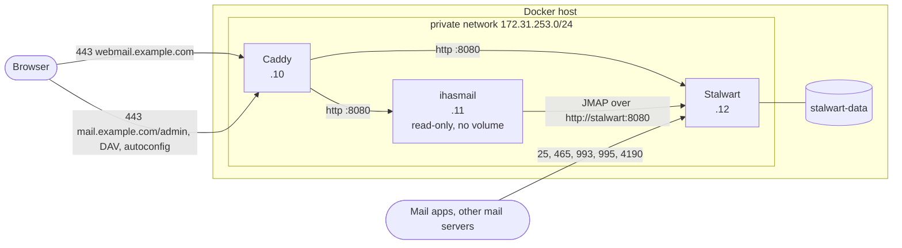
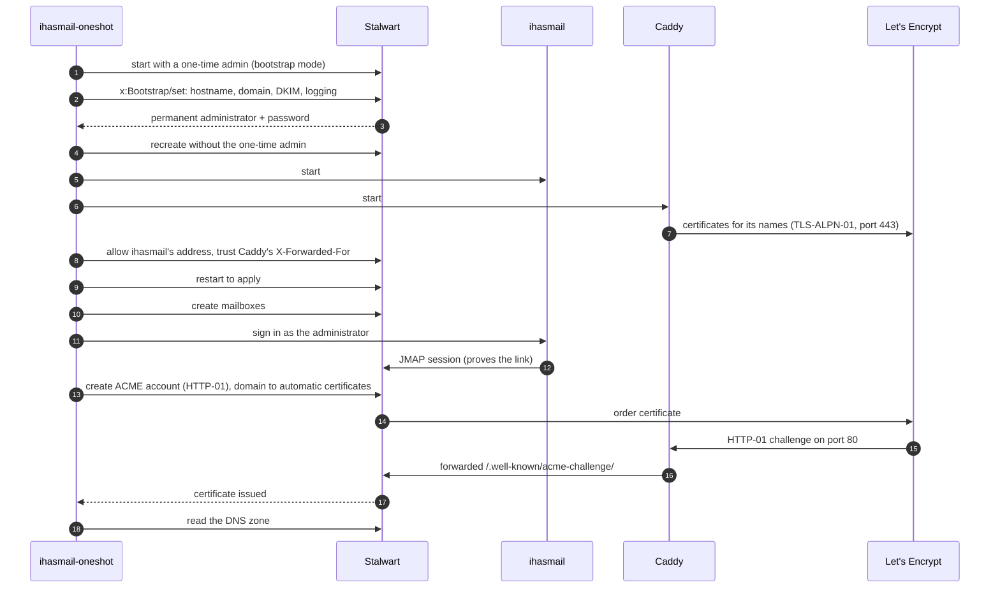

# How ihasmail-oneshot works

The design of the deployment this tool writes, and the reasons behind each
choice: what runs where, the order the deploy happens in, how Stalwart is set up
without its web wizard, how two services share certificates on one pair of
ports, and how Stalwart's automatic bans are kept from locking everyone out. For
installing and using the tool, start with the [README](../README.md) or the
[guide on docs.ihasmail.org](https://docs.ihasmail.org/install/oneshot/).

## Why it exists

Stalwart and ihasmail each install easily on their own. Making them a working,
safe mail host *together* takes a series of decisions that are easy to get
wrong, and most of the mistakes don't show until later:

- **Stalwart 0.16 has no configuration file to template.** Its settings live in
  its data store, and a new server starts in a bootstrap mode that expects a
  person at a web wizard. Automating that means driving its registry API, and
  making sure the bootstrap credential doesn't quietly outlive the setup.
- **Both services want the same ports for certificates.** The webmail needs
  HTTPS on 443. Stalwart needs its own certificate for IMAP and SMTP, and its
  default way of getting one also wants port 443. Two ACME clients fighting over
  one port fail in confusing, intermittent ways.
- **Stalwart's automatic IP bans don't expect a proxy in front of it.** Stalwart
  bans addresses that probe for things like WordPress admin pages. Behind a
  reverse proxy, every client arrives from the proxy's address, so one bot
  scanning your mail host gets *the proxy* banned. Autoconfig, calendar sync and
  certificate renewals all stop working, for everyone, with nothing obviously
  wrong. This was reproduced on Stalwart 0.16.22 while building this tool, as
  was a second trap: the setting that fixes it only takes effect after a
  restart.
- **The route from webmail to mail server matters.** Sent over the private
  Docker network, it never leaves the host and costs about a third of the
  memory per signed-in browser tab that going back out over public HTTPS does.
- **Mail doesn't flow until DNS is right**, and the list of records (MX, SPF,
  DKIM, DMARC, SRV, MTA-STS, autoconfig) is long.

This tool makes each of those decisions once, the same way every time, and
checks the result before telling you it is done. Each one is explained below.

## What it deploys

A single, statically linked binary for Linux (amd64 and arm64). You run it on
the Docker host that should become the mail server. It needs Docker and the
compose plugin, and nothing else: no configuration file to write first, no
language runtime, no other scripts.

It deploys three containers:

| Container | Image | Role |
| --- | --- | --- |
| **Stalwart** | `stalwartlabs/stalwart` | The mail server: SMTP, IMAP, POP3, JMAP, CalDAV, CardDAV, spam filtering, DKIM. It holds all the mail and all the accounts |
| **ihasmail** | `ghcr.io/coffey-labs/ihasmail` | The webmail: mail, calendars, contacts, files and filters in the browser, talking to Stalwart over JMAP. It holds nothing but sessions |
| **Caddy** | `caddy` | The HTTPS front: certificates and TLS for the webmail and for Stalwart's web side |

It has two shapes:

| | `deploy --domain example.com` | `deploy --local` |
| --- | --- | --- |
| **For** | A real mail host on the internet | Trying ihasmail against a real Stalwart on your own machine |
| **Containers** | Stalwart, ihasmail, Caddy | Stalwart, ihasmail |
| **Publishes** | 25, 80, 443, 465, 993, 995, 4190 on every interface | Nothing but two loopback ports |
| **Certificates** | Let's Encrypt, for both Caddy and Stalwart | None |
| **Webmail** | `https://webmail.example.com` | `http://127.0.0.1:8080` |
| **Stalwart admin** | `https://mail.example.com/admin` | `http://127.0.0.1:8081/admin` |

## What a deploy does, in order

In order, in one run:

1. **Checks the host** before changing anything: Docker and compose are there
   and usable, every port it needs is free, the deployment directory is new or
   empty, no compose project of the same name exists, and the hostnames resolve.
   It reports every problem at once, not the first.
2. **Finds ihasmail's newest release, shows you the plan and asks** before
   going ahead, so what you agree to is an exact ihasmail version. `--yes` skips the
   question, and is required when there is no terminal to ask on.
3. **Writes the deployment directory**: `compose.yaml`, the `Caddyfile`, and
   `.env` holding a freshly generated `APP_SECRET`.
4. **Pulls the images**: Stalwart and Caddy at the versions this release of the
   tool was tested with, and the ihasmail release it found, written into
   `compose.yaml` by its dated tag so nothing moves it later.
5. **Starts Stalwart in bootstrap mode** with a one-time administrator whose
   password exists only in the tool's memory.
6. **Completes Stalwart's setup** through its API, the same setup its web UI
   would otherwise walk you through: hostname, mail domain, DKIM keys, logging.
   Stalwart creates the permanent administrator and returns its password, which
   is written to `credentials.txt` straight away.
7. **Starts the whole stack.** Stalwart is recreated *without* the one-time
   administrator.
8. **Links ihasmail and Stalwart**: exempts ihasmail from Stalwart's automatic
   IP bans, tells Stalwart to trust the client addresses Caddy forwards, and
   restarts Stalwart so both apply.
9. **Creates the mailboxes** you asked for with `--user`, each with a generated
   password.
10. **Proves the link** by signing in *through ihasmail* as the administrator.
    That only succeeds if ihasmail can reach Stalwart and Stalwart accepts the
    credentials.
11. **Requests certificates** (mail host only): sets up an ACME account in
    Stalwart for its IMAP and SMTP certificate, and waits for that and for
    Caddy's certificates to arrive.
12. **Writes `dns-records.zone`**, every DNS record Stalwart wants published,
    and prints a summary of URLs, credentials and anything still to do.

## The shape of the deployment

- **Caddy** is the only thing on ports 80 and 443. It serves the webmail at the
  webmail host, and Stalwart's web side (admin UI, JMAP for other clients,
  CalDAV, CardDAV, autoconfig, MTA-STS) at the mail host and the
  `autoconfig`, `autodiscover`, `mta-sts` and `ua-auto-config` names.
- **Stalwart** publishes its mail ports directly, so SMTP and IMAP clients reach
  it with their real addresses.
- **ihasmail** talks to Stalwart over plain HTTP on the private network, as
  `http://stalwart:8080`. The browser never talks to Stalwart for webmail; it
  talks to ihasmail, and ihasmail makes the JMAP calls.
- The three containers have **fixed addresses**, because Stalwart is told about
  two of them (see below), and an address Docker picks afresh on every recreate
  couldn't be written into Stalwart's settings.

## The deploy, as a sequence

## Setting up Stalwart without its web wizard

Stalwart 0.16 keeps its configuration in its data store rather than a file. A
server started with an empty configuration comes up in **bootstrap mode**: a
temporary administrator and a setup wizard on port 8080. The wizard is a single
registry object, `x:Bootstrap`, written with one JMAP call.

The tool starts Stalwart with `STALWART_RECOVERY_ADMIN` set to a random password
held only in memory. It's passed through an override file that exists only for
that step, and through the environment of the `docker compose` process, never
written into `compose.yaml`. It then sets:

- `serverHostname` and `defaultDomain` from `--mail-host` and `--domain`;
- `generateDkimKeys` on, so outgoing mail is signed from the start;
- the log to **stdout**, because Stalwart's default log directory doesn't exist
  in the container image and isn't a volume;
- `requestTlsCertificate` **off**, because on 0.16.22 that switch creates no ACME
  account and leaves the domain on manual certificates, so it would look like
  certificates had been handled when they hadn't. The tool sets ACME up itself,
  explicitly.

Stalwart answers with a permanent administrator, `admin@DOMAIN`, and its
password. The tool writes that to `credentials.txt` before doing anything else,
so a failure later can't lose it. Then it brings the full stack up from
`compose.yaml` alone, which recreates Stalwart without the one-time
administrator, so no fixed recovery credential outlives the setup.

The tool refuses to set up a Stalwart that isn't in bootstrap mode, so it can
never reconfigure a server that already holds someone's mail.

## Certificates for two services on one pair of ports

Caddy needs certificates to serve HTTPS. Stalwart needs its own for IMAP, POP3,
submission and STARTTLS on SMTP. Both need one for the mail host's name, and
both would normally want port 443 to prove they control it.

They're separated by **ACME challenge type**:

| | Challenge | Port | How |
| --- | --- | --- | --- |
| **Caddy** | TLS-ALPN-01 | 443 | Configured with `disable_http_challenge` for Stalwart's names |
| **Stalwart** | HTTP-01 | 80 | Caddy forwards `/.well-known/acme-challenge/*` for Stalwart's names to Stalwart, untouched. Everything else on port 80 is redirected to HTTPS |

Neither ever answers the other's challenge, and neither needs the other's key.
Stalwart's certificate covers the mail host plus `autoconfig`, `autodiscover`,
`mta-sts` and `ua-auto-config` under the domain, the names its own DNS zone
points at the mail host, and Caddy fronts all five so every challenge reaches
it.

Stalwart starts its order as soon as the ACME account exists, and renews by
itself from then on. If an order fails, usually because DNS isn't in place yet,
Stalwart doesn't try again by itself. `certs` starts a new order.

## Stalwart's automatic IP bans, behind a proxy

Stalwart bans an IP address that behaves like an attacker. For example, 30
requests in a day for scanner paths such as `/wp-admin.php` get an address
banned. That's good protection, but it counts by the address a connection comes
from, and two kinds of traffic reach Stalwart from a single shared address:

1. **Everything through Caddy** arrives from Caddy's address. Unchanged, one bot
   scanning `https://mail.example.com` bans Caddy. That was reproduced on
   0.16.22: after a scan, autoconfig answered `403` to everyone, and so would
   calendar sync and certificate renewal.

   **Fix:** Stalwart is told to take the client's address from the
   `X-Forwarded-For` header Caddy sets. Re-tested after the change, the scanner
   was banned and every other client still got through. This is safe only
   because nothing untrusted can reach Stalwart's HTTP port: it's published on
   loopback alone, and on the private network its only peers are Caddy, which
   sets the header itself, and ihasmail, which sends none.

2. **Every webmail request** arrives from ihasmail's address: every sign-in, and
   every push stream opened and dropped as people open and close tabs. A ban on
   that one address would be a ban on everyone's webmail.

   **Fix:** ihasmail's fixed address is added to Stalwart's allowed addresses.
   ihasmail limits sign-in attempts per real client itself, so repeated wrong
   passwords are still slowed down, just not by banning the webmail.

On 0.16.22 **neither setting takes effect until Stalwart restarts**. Applied to
a running server, a scan straight afterwards still banned Caddy. So the tool
restarts Stalwart after making both changes, before anything else depends on
them.

## The webmail's side

ihasmail is deployed the way its own documentation recommends for this
situation:

- **Immutable**: read-only root filesystem, no volume, sessions in memory. A
  restart signs everyone out and loses nothing else, because everything durable,
  each user's settings included, lives in Stalwart.
- **Private route to Stalwart** (`STALWART_URL=http://stalwart:8080`): the
  credentials that travel on that leg never leave the host.
- **Push by subscription** (`PUSH_URL=https://webmail.example.com`): Stalwart
  posts mailbox changes to ihasmail instead of holding a connection open for
  every browser tab. If Stalwart can't reach that URL, every tab uses the
  ordinary relay instead and nothing breaks. `/api/health` shows which is in use.
- **Behind a trusted proxy** (`TRUST_PROXY=1`): ihasmail believes Caddy's
  forwarded headers, because Caddy is on a private network range, so it sets
  secure cookies and attributes sign-in attempts to the real client.
